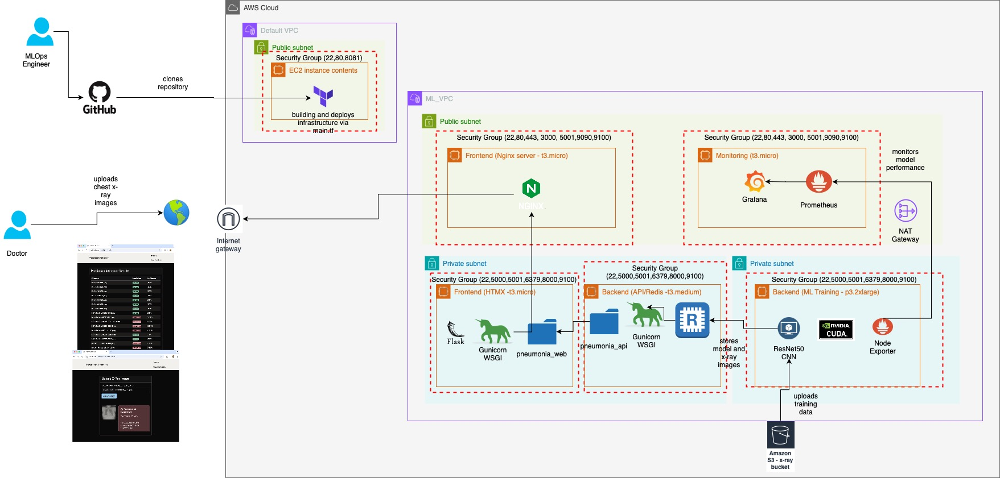
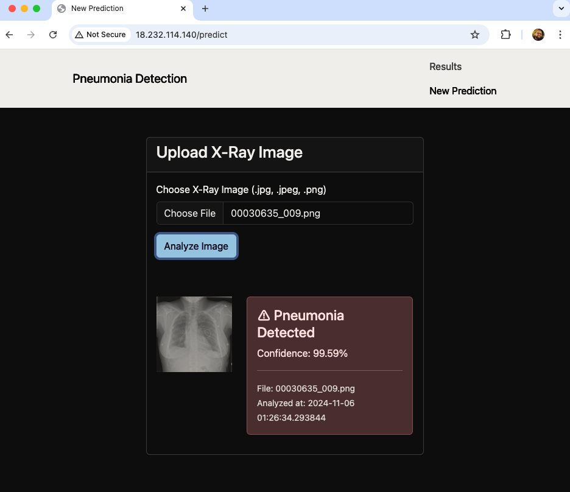
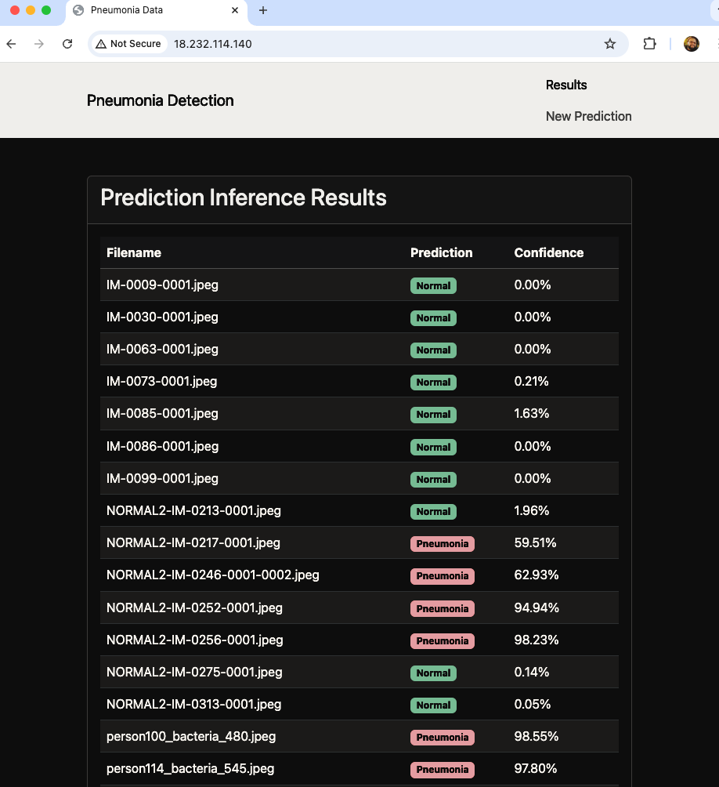
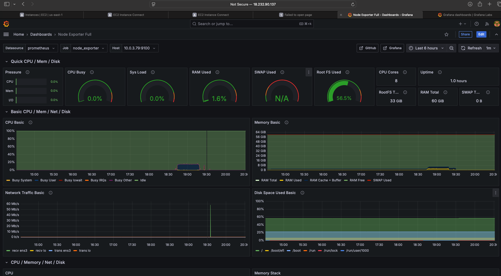
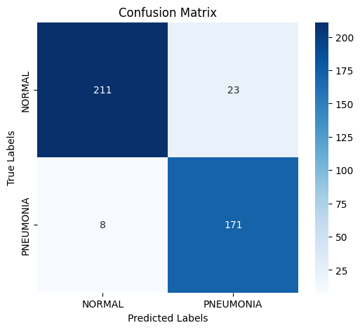
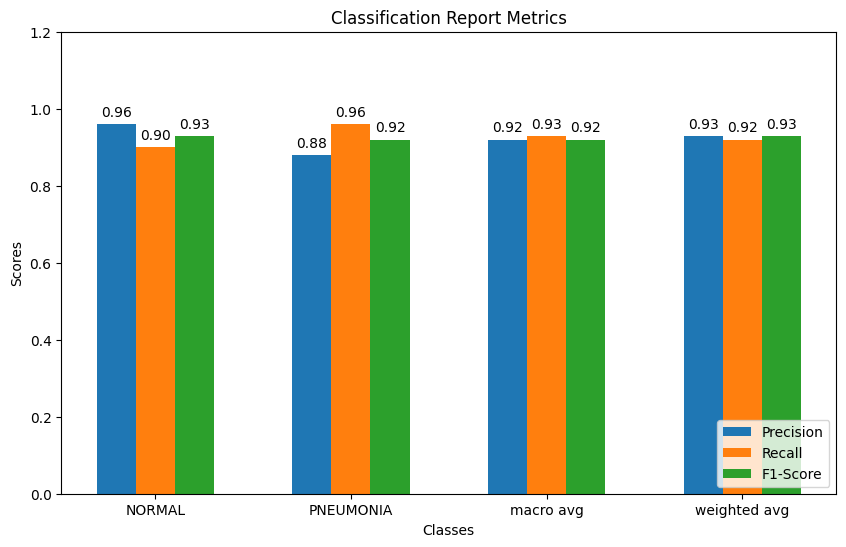

# Pneumonia Detection Application

## Purpose

The purpose of this project is to develop an application that enables doctors to upload X-ray images via a frontend interface to detect pneumonia. The application processes the uploaded images through a neural network model hosted on the backend. The model analyzes the images and stores the results in Redis, making them accessible and visible on the frontend for the user.

## Infrastructure Overview




This section provides a detailed technical overview of the pneumonia detection application's infrastructure deployed on AWS. The architecture leverages cloud resources, containerized applications, and monitoring tools to support the deployment, operation, and monitoring of an ML model for detecting pneumonia from chest X-ray images.

---

## Infrastructure Components and Architecture

### 1. AWS Cloud Environment

- The setup is deployed within AWS, using both the **Default VPC** and a custom **ML VPC**. The ML VPC is divided into public and private subnets for enhanced security and efficient resource management.

### 2. Public Subnet (Accessible via the Internet Gateway)

- **EC2 Instance (Repository Management)**:
  - Hosts an EC2 instance to clone the application repository from **GitHub**. This allows **MLOps engineers** to manage and deploy the application's codebase. Infrastructure is provisioned, possibly using **Terraform**.
  - Security group allows access to port 22 (SSH), ports 80 and 8081 for web services.

- **Frontend (Nginx Server)**:
  - Deployed on a `t3.micro` instance, **Nginx** serves as the web front end, routing HTTP requests to relevant services.
  - Security group allows traffic on essential ports (e.g., 22, 80, 443, 3000, 5001, 9090, 9100) for web traffic and monitoring.
  - This server connects to a **Flask**-based HTMX service in the private subnet, providing an interactive interface for uploading X-ray images and displaying diagnostic results.

- **Monitoring (Grafana & Prometheus)**:
  - Prometheus and Grafana, on a separate `t3.micro` instance, monitor the application’s performance.
  - Prometheus collects metrics, while Grafana displays them in a dashboard.
  - Accessed via **NAT Gateway** for secure interaction with private subnet resources.

### 3. Private Subnet (Isolated for Security)

- **Frontend (HTMX with Flask on Gunicorn WSGI Server)**:
  - Hosted on a `t3.medium` instance, the HTMX and **Flask** application allows doctors to upload chest X-ray images and view results.
  - Security groups restrict access to select ports (e.g., 22, 5000, 8000).
  - Requests are forwarded to the backend model API for processing and diagnosis.

- **Backend (ML Training Server with ResNet50 CNN)**:
  - Deployed on a **p3.2xlarge** instance with **NVIDIA CUDA** for accelerated ML computations.
  - **ResNet50 CNN** model processes the chest X-ray images to detect pneumonia.
  - **Node Exporter** collects hardware and OS metrics for Prometheus, enabling detailed monitoring.

- **Redis Cache**:
  - Redis provides a caching layer for storing processed data and model predictions, minimizing latency on repeated requests.
  - It can also function as a queue during high-load scenarios.

### 4. Amazon S3 Bucket for Image Storage

- **Amazon S3** is used to store the chest X-ray images uploaded by doctors and holds training data for model improvements.
- The backend server retrieves data from this bucket, which can also archive processed data and model versions.

---

## Workflow

1. **Doctor Interaction**:
   - A doctor accesses the web frontend via Nginx, uploads chest X-ray images, and views the results.

2. **Image Processing and Diagnosis**:
   - Uploaded images are sent to the backend (ResNet50 CNN) in the private subnet for processing.
   - Diagnosis results are returned to the frontend for display.

3. **Model Training and Optimization**:
   - The backend instance periodically updates the model with new data from S3, leveraging the GPU-enabled p3.2xlarge instance for accelerated training.

4. **Monitoring**:
   - Prometheus collects performance metrics, which Grafana visualizes. The MLOps engineer can monitor CPU usage, memory, and inference latency.

5. **Model Management**:
   - MLOps engineers clone the repository, manage code updates, and redeploy infrastructure as needed.

---

## Security Measures

1. **VPC Segmentation**:
   - Sensitive services are isolated in the private subnet, reducing exposure to the internet.

2. **Security Groups**:
   - Instances have controlled security groups that limit access to essential ports only.

3. **NAT Gateway**:
   - Enables instances in the private subnet to securely access the internet without exposing them directly.

4. **AWS IAM and Access Management**:
   - IAM roles and policies control access to resources, ensuring only authorized access to sensitive data.

---

## Steps for ML Model Contruction and Tuning

The application involves several essential steps to ensure model accuracy, reliability, and efficient visibility of results on the frontend. Here’s a step-by-step breakdown of the workflow, technical components, and code snippets for the application.

### 1. Data Storage and Access (AWS S3)
   - **Setup**: All X-ray images are stored in an Amazon S3 bucket (`x-raysbucket`), which serves as a scalable and secure data storage solution.
   - **Purpose**: S3 provides a centralized and durable storage location where images can be accessed by the backend for processing and inference. This setup ensures that data remains secure and accessible across various services.
   - **Code**:
     ```bash
     # Install AWS CLI
     !pip install awscli
     !mkdir -p /content/chest_xray/
     # Download dataset from S3
     !aws s3 cp s3://x-raysbucket/chest_xray/ /content/chest_xray/ --recursive --no-sign-request
     ```

### 2. Data Preprocessing and Augmentation
   - **ImageDataGenerator**: For training, data augmentation is performed using Keras’s `ImageDataGenerator`, which applies transformations such as rotation, scaling, and flipping.
   - **Purpose**: Augmentation artificially expands the dataset, allowing the model to generalize better by learning from diverse variations of the same image. This reduces overfitting and improves accuracy, especially important when working with limited medical datasets.
   - **Code**:
     ```python
     from tensorflow.keras.preprocessing.image import ImageDataGenerator

     train_datagen = ImageDataGenerator(
         rescale=1./255,
         rotation_range=10,
         width_shift_range=0.1,
         height_shift_range=0.1,
         horizontal_flip=True
     )
     val_datagen = ImageDataGenerator(rescale=1./255)
     test_datagen = ImageDataGenerator(rescale=1./255)
     ```

### 3. Model Selection and Transfer Learning (ResNet50)
   - **Base Model (ResNet50)**: The application uses a pre-trained ResNet50 model, which has been trained on the ImageNet dataset. The model’s final layers are replaced and fine-tuned for pneumonia detection.
   - **Layer Freezing**: The initial layers of ResNet50 are frozen to retain the pre-trained weights, which capture fundamental image features like edges and textures.
   - **Code**:
     ```python
     from tensorflow.keras.applications import ResNet50
     base_model = ResNet50(weights='imagenet', include_top=False, input_shape=(224, 224, 3))

     # Unfreeze last 20 layers of ResNet50
     for layer in base_model.layers[-20:]:
         layer.trainable = True
     ```

### 4. Custom Layers for Binary Classification
   - **Dense Layers and Dropout**: Adds additional layers with dropout to prevent overfitting.
   - **Output Layer (Sigmoid Activation)**: A single neuron with sigmoid activation is used for binary classification.
   - **Code**:
     ```python
     from tensorflow.keras.layers import Dense, GlobalAveragePooling2D, Dropout, BatchNormalization

     x = base_model.output
     x = GlobalAveragePooling2D()(x)
     x = BatchNormalization()(x)
     x = Dense(128, activation='relu')(x)
     x = BatchNormalization()(x)
     x = Dense(256, activation='relu')(x)
     x = BatchNormalization()(x)
     x = Dense(128, activation='relu')(x)
     x = Dropout(0.5)(x)
     x = Dense(1, activation='sigmoid')(x)

     model = Model(inputs=base_model.input, outputs=x)
     ```

### 5. Model Training with Optimizations
   - **Early Stopping and Checkpointing**: Stops training if validation loss stops improving and saves the best model weights.
   - **Learning Rate Scheduler**: Reduces the learning rate when validation loss plateaus.
   - **Code**:
     ```python
     from tensorflow.keras.callbacks import EarlyStopping, ModelCheckpoint, ReduceLROnPlateau

     callbacks = [
         EarlyStopping(monitor='val_loss', patience=5, restore_best_weights=True),
         ModelCheckpoint('best_model.keras', monitor='val_accuracy', save_best_only=True),
         ReduceLROnPlateau(monitor='val_loss', factor=0.2, patience=3, min_lr=1e-6)
     ]

     model.compile(
         optimizer=tf.keras.optimizers.Adam(learning_rate=1e-3),
         loss='binary_crossentropy',
         metrics=['accuracy']
     )

     history = model.fit(
         train_generator,
         steps_per_epoch=train_generator.samples // train_generator.batch_size,
         validation_data=val_generator,
         validation_steps=val_generator.samples // val_generator.batch_size,
         epochs=30,
         class_weight=class_weight,
         callbacks=callbacks
     )
     ```

### 6. Frontend-Backend Communication (Nginx Reverse Proxy)
   - **Nginx**: Acts as a reverse proxy for the application frontend, managing HTTP requests and providing secure communication with backend services.

### 7. Backend API and Redis Caching
   - **Backend API (Flask with Gunicorn)**: The backend API is built using Flask and deployed with Gunicorn. It processes images, retrieves prediction results, and stores them in Redis for quick access.

### 8. Model Inference (ResNet Model with GPU Support)
   - **p3.2xlarge EC2 Instance**: The model is deployed on a GPU-enabled EC2 instance, optimized for deep learning inference tasks.

### 9. Frontend Display and User Interface
   - **Frontend UI**: Built with HTML and JavaScript, the frontend enables doctors to upload X-ray images and view predictions in real-time.





### Summary of Model Results

The model shows strong performance in classifying between "NORMAL" and "PNEUMONIA" cases, with an overall accuracy of **92%**. Below is a breakdown of the metrics:



1. **Confusion Matrix**:
   - **True Negatives (TN)**: 211 images correctly classified as "NORMAL."
   - **False Positives (FP)**: 23 images incorrectly classified as "PNEUMONIA."
   - **False Negatives (FN)**: 8 images incorrectly classified as "NORMAL."
   - **True Positives (TP)**: 171 images correctly classified as "PNEUMONIA."



2. **Classification Report**:
   - **Precision for NORMAL**: 0.96 – the model is 96% accurate when it predicts "NORMAL."
   - **Recall for NORMAL**: 0.90 – the model correctly identifies 90% of actual "NORMAL" cases.
   - **Precision for PNEUMONIA**: 0.88 – the model is 88% accurate when it predicts "PNEUMONIA."
   - **Recall for PNEUMONIA**: 0.96 – the model identifies 96% of actual "PNEUMONIA" cases.

These metrics indicate a balance in precision and recall across both classes, resulting in high f1-scores of **0.93** for "NORMAL" and **0.92** for "PNEUMONIA." This balance supports the model’s reliability in distinguishing between the two categories.


## Troubleshooting

During development, several challenges were encountered, especially with server setup, model configuration, and system integration:

- **SSH Tunneling between Private and Public Servers**:
   - Solution: Configured SSH tunneling and security groups to ensure secure communication.
- **Configuring NVIDIA Drivers on the p3 EC2 Instance**:
   - Solution: Installed and configured CUDA and NVIDIA drivers.
- **Tuning the Model to Improve Accuracy**:
   - Solution: Adjusted learning rate, added dropout layers, and employed batch normalization.

## Optimization

To further optimize this deployment:
1. **Optimize Data Caching**: Improve Redis configurations or switch to an in-memory database for faster response times.
2. **Scale GPU Instances Dynamically**: Scale the p3 instance based on user demand to manage costs.
3. **Optimize Frontend Load Balancing**: Use an AWS ELB to handle high user loads.
4. **Use Managed Services for Monitoring**: Replace Prometheus and Grafana with Amazon CloudWatch.

## Conclusion

This project provided a comprehensive experience in deploying a machine learning model in a cloud environment, integrating frontend and backend components, and managing resources efficiently.

Key takeaways include:
- **Transfer Learning**: Using ResNet50 accelerated model training and improved accuracy.
- **Cloud Architecture**: Configuring secure communication between private and public servers, using Nginx as a reverse proxy, and managing data flow through Redis taught valuable lessons in cloud infrastructure.
- **Resource Management**: Setting up a GPU-enabled instance (p3.2xlarge) and troubleshooting NVIDIA drivers highlighted the challenges of handling specialized hardware in the cloud.
